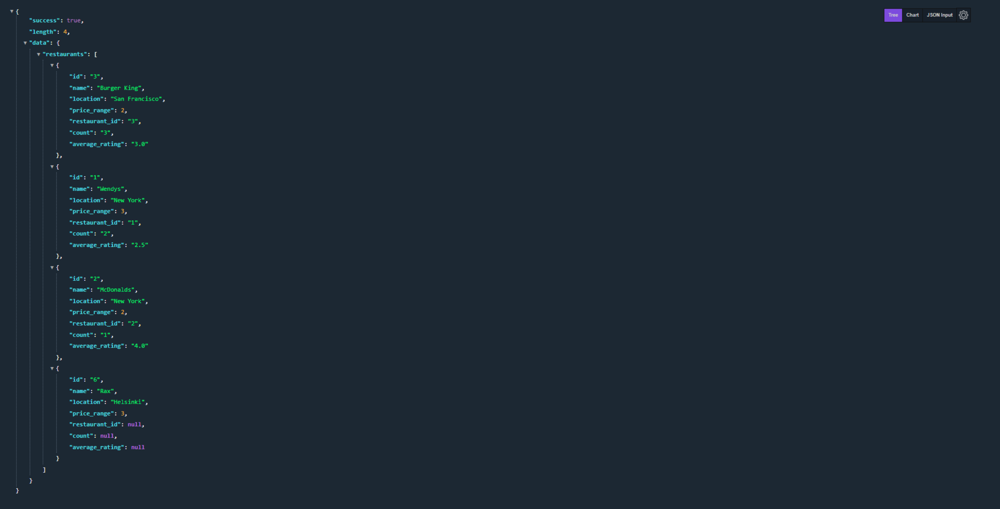

## Yelp Clone with PERN-STACK



## Installation

1- Clone the repo

```bash
https://github.com/capo33/yelp_clone/tree/main/backend
```

2- Install dependencies

```bash
yarn
```

3- Create .env file

4- Add your own data in .env file

```bash
PORT= your PORT

# Database connection string
PGUSER= your POSTGRES_USER
PGHOST= your POSTGRES_HOST
PGPASSWORD= your POSTGRES_PASSWORD
PGDATABASE= your POSTGRES_DATABASE
PGPORT=5432
```


## Usage

1- Go to the root directory and start the server

```
yarn run dev
```


## Tech

- [node.js]
- [Express]
- [postgreSQL]
- [Typescript]

  [node.js]: http://nodejs.org
  [express]: http://expressjs.com
  [postgreSQL]: https://www.postgresql.org/
  [Typescript]: https://www.typescriptlang.org/
